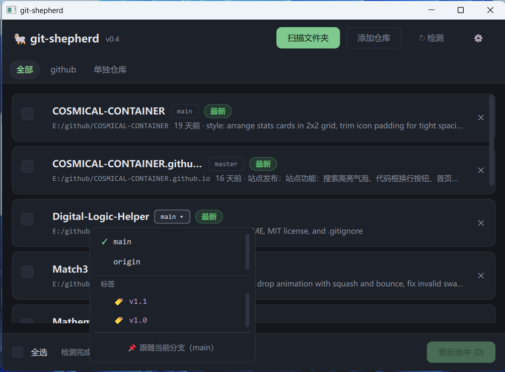
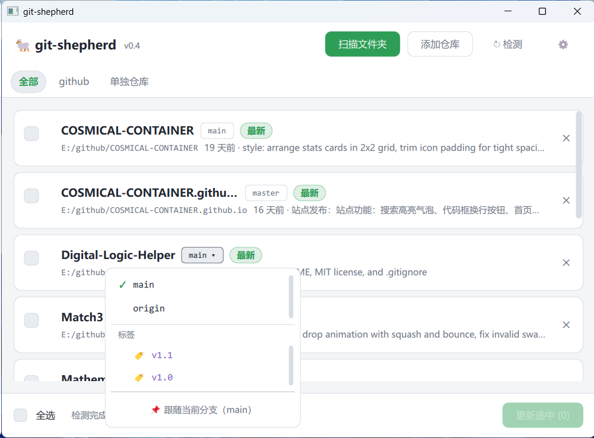

# git-shepherd — 0.4.0

🐑 应用商店式的 Git 仓库更新管理器。把散落在电脑各处的 `git clone` 项目登记成一张表，打开软件自动检测谁有更新，像应用市场一样勾选、一键批量 `git pull`。

| 功能 | 说明 |
|------|------|
| 📁 **Tab 管理** | 「全部」/ 每个扫描过的文件夹（可关闭、可重新扫描拾取新 clone）/「单独仓库」 |
| 🔍 **自动检测** | 启动即对全部仓库 `git fetch`，线程池并发限流，落后/领先提交数一目了然 |
| 🏷️ **状态徽章** | 最新 · 可更新 · 本地改动 · 未推送/分叉 · 无上游 · 错误，全实时 |
| 🔀 **分支切换** | 点分支 chip 弹出菜单，本地 + 远端分支一键切换（远端自动建跟踪分支） |
| 🏷 **标签检出** | 同一菜单内列出最近 20 个标签，点选即 `git checkout` 到该标签，卡片显示当前标签 |
| 📌 **跟随分支** | 为每个仓库设"跟随分支"（跟 master 还是跟稳定分支，各定各的），偏离时一键切回 |
| ⬇️ **批量更新** | 勾选 / 全选 → 批量 `git pull --ff-only`，结束汇总成功/跳过/失败 |
| 🎨 **深浅主题** | ⚙ 设置里一键切换深色 / 浅色，选择持久化 |
| 💾 **列表持久化** | 仓库与文件夹登记、跟随分支全部落盘，下次打开直接用 |

## 效果预览

| 深色 | 浅色 |
|:---:|:---:|
|  |  |

*主界面：顶部为全局操作与文件夹 Tab 栏，中间是仓库卡片列表（复选框 / 仓库名 / 分支 chip / 状态徽章 / 落后提交数 / 最近提交），底部为全选、检测汇总与「更新选中」。点任意分支 chip 即可切换分支、检出标签或设置跟随分支（如图）。*

## 设计哲学

- **想更新了才打开它** —— 不开机自启、不后台常驻、不定时轮询、不静默 pull，一切更新必须由你主动勾选触发
- **永远不碰你的本地改动** —— 只做 `--ff-only` 快进合并；工作区有改动、领先上游、非快进的仓库一律跳过并说明原因
- **调用本机 git** —— 不重新实现协议，凭据沿用系统 git 配置（SSH key / 凭据管理器），软件本身不管账号密码

## 前提条件

| 依赖 | 要求 |
|------|------|
| 操作系统 | Windows（Qt 可跨平台，暂未适配其他系统） |
| git | 已安装并在 PATH 中 |
| Qt | ≥ 6.8（仅自行编译时需要，含 Quick / QuickControls2） |
| 构建工具 | CMake ≥ 3.21 + Ninja + MinGW 或 MSVC |

## 构建

```bash
cmake -G Ninja -B build \
    -DCMAKE_BUILD_TYPE=Release \
    -DCMAKE_PREFIX_PATH=<你的Qt路径> \
    -DCMAKE_CXX_COMPILER=<编译器路径>
cmake --build build
windeployqt build/git-shepherd.exe   # 部署 DLL，之后可直接双击运行
```

## 使用

| 操作 | 说明 |
|------|------|
| 扫描文件夹 | 选一个父目录，递归（3 层）发现 git 仓库，勾选导入；该文件夹自动成为一个 Tab |
| 重新扫描 | 在文件夹 Tab 下点「↻ 重新扫描此文件夹」，拾取新 clone 的项目 |
| 添加仓库 | 单独添加一个仓库，进「单独仓库」Tab |
| 切换分支 | 点卡片上的分支 chip → 菜单选分支；远端分支自动 `checkout -t`；「标签」区点选检出对应 tag |
| 跟随分支 | 分支菜单底部「📌 跟随当前分支」；偏离时卡片出现琥珀色一键切回按钮 |
| 批量更新 | 勾选若干仓库（或全选）→「更新选中 (N)」 |
| 移除 | 卡片右侧 ✕ 移除单个仓库；文件夹 Tab 悬停 ✕ 整体移除 |

仓库列表持久化在 `%APPDATA%\git-shepherd\git-shepherd.ini`。

## 常见问题

**Q：为什么有的仓库不能更新？**
仅「可更新」状态（干净且落后于上游）会执行 `git pull --ff-only`。本地有改动、有未推送提交（分叉）、无上游分支的仓库会跳过并标注原因——这是刻意的安全设计。

**Q：fetch 很慢或超时？**
软件禁用了 git 的交互式凭据提示，私有仓库凭据失效时会快速失败而不是挂死；重新在系统 git 里配置好凭据后再点「↻ 检测」。

**Q：切分支会丢我的改动吗？**
不会。工作区有改动时会直接拒绝切换并提示；切换本身只做 `git checkout`。

**Q：支持 macOS / Linux 吗？**
代码未做平台假设，理论上可编译运行，但只在 Windows 上测试过。

## 目录结构

```
git-shepherd/
├── CMakeLists.txt
├── main.cpp
├── src/
│   ├── AppSettings.cpp/.h     # QSettings 封装（主题等设置）
│   ├── GitRunner.cpp/.h       # QProcess 同步执行 git，带超时
│   ├── RepoScanner.cpp/.h     # BFS 扫描发现 git 仓库
│   ├── RepoModel.cpp/.h       # 列表模型 + 检测/更新/切分支调度 + 持久化
│   └── RepoFilterProxy.cpp/.h # 按 Tab 过滤的代理模型
└── qml/GitShepherd/
    ├── Main.qml               # 主窗口（顶栏 / Tab 栏 / 列表 / 底栏）
    ├── Theme.qml              # 深浅双主题单例
    ├── RepoCard.qml           # 仓库卡片
    ├── BranchMenu.qml         # 分支切换 / 跟随分支菜单
    ├── StatusBadge.qml        # 状态徽章
    ├── ScanDialog.qml         # 扫描导入对话框
    ├── SettingsMenu.qml       # 设置菜单
    └── AppButton.qml          # 通用按钮
```

## 更新日志

**0.4.0** — 分支菜单新增标签区（最近 20 个，新在前），点选检出对应 tag（detached 状态卡片显示 🏷 标签名）；切换类型显式区分本地分支 / 远端分支 / 标签，避免同名歧义。

**0.3.0** — 新增 ⚙ 设置与深浅双主题（即时切换、持久化）。

**0.2.0** — 新增文件夹 Tab 管理（全部/各文件夹/单独仓库，可关闭、可重扫描）与分支管理（本地/远端一键切换、📌 跟随分支、偏离一键切回）。

**0.1.0** — 首个版本：扫描/添加仓库、启动自动检测、状态徽章、勾选批量 `git pull --ff-only`。

## License

[MIT](LICENSE)
